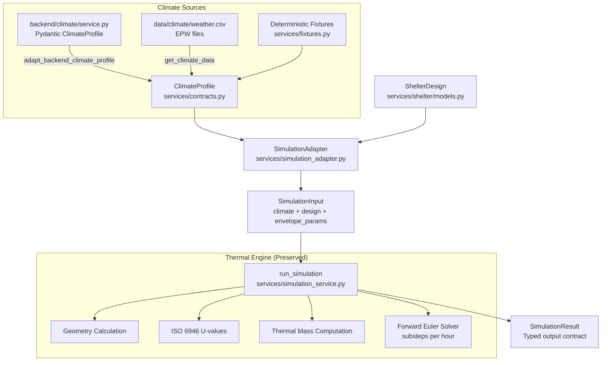

# Phase 2 — Integration: Canonical Design + Climate → Thermal Simulation

## Overview

Phase 2 connects the canonical engineering pipeline end-to-end, proving that the
**real Python thermal simulation engine** responds correctly to changes in all
design parameters: climate, geometry, materials, insulation, glazing, orientation,
ventilation, thermal mass, and occupancy.

**Branch:** `integration-react-final`
**Tests:** 280 passed (244 existing + 36 new), 0 failed

---

## Canonical Data Flow

## Climate Mapping

### services.contracts.ClimateProfile (Canonical)
Flat hourly-timeseries format consumed directly by the thermal engine:
- `hourly_temperature` (°C)
- `hourly_direct_solar` (W/m², DNI)
- `hourly_diffuse_solar` (W/m², DHI)
- `hourly_wind_speed` (m/s, optional)
- `hourly_humidity` (%, optional)
- `hourly_cloud_cover` (fraction, optional)
- `hourly_precipitation` (mm, optional)
- `timestamps` (ISO 8601, optional)
- `elevation_m`, `timezone_offset_hours`, `latitude`, `longitude`
- `data_source`, `data_provenance`, `data_confidence`

### backend.climate.schemas.ClimateProfile (Member 1 Pydantic)
Structured statistical/annual model with nested objects:
- `Location` (place_name, lat, lon, elevation)
- `ClimateMetrics` (classification, annual_mean_temperature, min, max, diurnal_range)
- `SolarData` (GHI, DNI, DHI annual means)
- `WindData` (average_speed)
- `HumidityData` (average_relative_humidity)
- `DesignExtremes` (cold_extreme, hot_extreme, HDD, CDD)
- `DataQuality` (confidence, provenance, sources)

### Adapter: `adapt_backend_climate_profile()`
Maps Member 1's structured model → canonical flat timeseries by synthesizing
a deterministic 168-hour diurnal profile from statistical data. The resulting
`data_provenance` is always set to `ESTIMATED` to clearly distinguish synthetic
profiles from measured hourly data.

**Preserved data:** location, elevation, climate zone, temperature range, solar
peaks, wind speed, humidity, confidence, source citations.

**Not lost:** No information from the backend model is silently dropped. Fields
that cannot map to hourly timeseries are preserved as metadata.

## ShelterDesign → SimulationInput Mapping

### Supported Fields (consumed by thermal engine)

| Category | Field | Source | Engine Parameter |
|---|---|---|---|
| **Geometry** | length, width, height | `geometry.length_m/width_m/height_m` | Floor area, volume, wall area, roof area |
| | roof_type, pitch_angle_deg | `geometry.roof_type/roof_pitch_deg` | Pitched vs flat geometry |
| | orientation | `geometry.orientation_deg` or metadata | Solar orientation factor |
| | window_area | Computed from openings | Glazing aperture area |
| **Envelope** | wall_material | `wall_assembly.layers[0].material_id` | Conductivity lookup |
| | wall_thickness_m | `wall_assembly.layers[0].thickness_m` | Layer resistance |
| | insulation_thickness_m | Insulation layer in wall_assembly | Added R-value |
| | insulation_conductivity | Insulation layer conductivity | Added R-value |
| | roof_thickness_m | `roof_assembly.layers[0].thickness_m` | Roof layer resistance |
| | roof_conductivity | `roof_assembly.layers[0].conductivity_w_mk` | Roof R-value |
| | roof_insulation_m | Insulation layer in roof_assembly | Roof insulation R-value |
| **Glazing** | glazing type (id) | `glazing.id` → GLAZING_PROPERTIES lookup | U-glass, SHGC |
| | shgc | `glazing.shgc` | Solar heat gain coefficient |
| **Ventilation** | ach | `metadata["ach"]` or requirements.constraints | Ventilation heat loss |
| **Occupancy** | occupants | `requirements.occupants` | Internal heat gain |
| | heat_per_person | `metadata["heat_per_person"]` | Internal gain per person |
| **Thermal Mass** | wall density, specific heat | Material lookup from wall_material | Effective thermal capacity |
| | shelter_model | metadata | Geometry profile selection |

### Unsupported Fields (not consumed by current engine)

| Field | Reason | Recommendation |
|---|---|---|
| `thermal_mass_elements` (dedicated Trombe walls, water walls) | Engine computes thermal mass from wall/roof/floor material properties only | Future: add explicit thermal mass injection to `run_simulation()` |
| `passive_strategies` (detailed strategy parameters) | Engine uses orientation factor and ACH, not strategy objects | Future: map strategy parameters to engine inputs |
| `door_assembly` | Engine does not model doors separately | Future: add door thermal conductance |
| `zones` (spatial functional zones) | Engine uses single-zone lumped model | Future: multi-zone simulation |
| `openings` (individual opening details) | Engine uses total window_area only | Future: per-facade solar calculation |
| `floor_assembly` layers | Engine uses hardcoded floor k=1.20, thickness=0.15 | Future: pass floor assembly to engine |

## Simulation Entry Point

**Function:** `run_simulation()` in [`services/simulation_service.py`](file:///c:/Users/LENOVO/Documents/SIH%20Round%202/sih-area-specific-shelter/services/simulation_service.py)

**Method:** Single-zone lumped-capacitance transient model with explicit forward Euler
time integration (`dt = 3600/substeps` seconds per step).

**Physics:**
1. ISO 6946 multi-layer thermal resistance → U-values for walls, roof, floor
2. Glazing SHGC × orientation factor × irradiance → solar gain
3. Conductive heat loss: `UA × ΔT` for each envelope component
4. Ventilation heat loss: `ρ × ACH × V × cₚ × ΔT / 3600`
5. Internal gains: `n_occupants × heat_per_person + 40W` (base equipment)
6. Longwave radiation: `ε × σ × A_roof × (T_in⁴ - T_out⁴)`
7. Thermal capacitance: lumped from wall, roof, floor material properties
8. Temperature update: `T_{t+dt} = T_t + (Q_net × dt) / C_thermal`

## Heat-Flow Accounting

SimulationResult provides all categories needed for a future React dashboard:

| Category | Field | Status |
|---|---|---|
| Indoor temperature over time | `indoor_temperatures` | ✅ Available |
| Outdoor temperature over time | `outdoor_temperatures` | ✅ Available |
| Solar gains | `solar_thermal_gain` | ✅ Available |
| Wall heat flow | `wall_heat_flow` | ✅ Available |
| Roof heat flow | `roof_heat_flow` | ✅ Available |
| Floor heat flow | `floor_heat_flow` | ✅ Available |
| Window/glazing heat flow | `window_heat_flow` | ✅ Available |
| Ventilation heat flow | `ventilation_heat_flow` | ✅ Available |
| Internal gains | `hourly_internal_gain` | ✅ Available |
| Net heat balance | `net_heat_flow` | ✅ Available |
| Thermal storage/mass effects | `thermal_storage_flow` | ✅ Available |
| Radiation heat flow | `radiation_heat_flow` | ✅ Available |
| Heating demand | `hourly_heating_demand` | ✅ Available |
| Cooling demand | `hourly_cooling_demand` | ✅ Available |
| Comfort status series | `comfort_status_series` | ✅ Available |

## Solar Energy Accounting

The simulation clearly distinguishes:

1. **Incident solar energy** (`solar_power`): Total irradiance × window area. Represents
   the full solar power intercepted by the fenestration aperture.
2. **Transmitted solar gain** (`solar_thermal_gain`): Incident × SHGC × orientation factor.
   Represents the useful solar heat gain entering the shelter interior through glazing.
3. **Captured solar gain ≤ Incident solar**: Verified by test `test_incident_vs_captured_solar`.

> [!IMPORTANT]
> The simulation does NOT call all incident solar radiation "thermal energy generated."
> Only the SHGC-transmitted portion is counted as interior solar gain.

## Provenance and Engineering Honesty

- All fixture data is labeled as `ESTIMATED` or `USER_DEFINED`
- No claims of "measured" data, "certified ISO compliance", or "field validated accuracy"
- U-values are described as "calculations based on ISO 6946 layer-resistance methodology"
- The model is a "reduced-order engineering model" using a "single-zone lumped-capacitance"
  approach, not a CFD or multi-zone detailed simulation

## Sensitivity Test Results

All 9 sensitivity categories pass, proving the simulation is fully connected:

| Test | Parameter Changed | Verified Response | Status |
|---|---|---|---|
| A. Insulation | 0.02m → 0.15m | Wall heat loss decreases, U-value decreases | ✅ |
| B. Window Area | 1.0m² → 4.0m² | Solar gain increases, window heat flow increases | ✅ |
| C. Orientation | South → North | Solar gain decreases, indoor temp drops | ✅ |
| D. Ventilation | ACH 0.3 → 2.0 | Ventilation loss increases, total loss increases | ✅ |
| E. Thermal Mass | Timber 100mm → Brick 300mm | Temperature swing dampened | ✅ |
| F. Geometry | 3×2.5×2.4 → 6×4×3 | Volume increases, wall loss increases | ✅ |
| G. Material | Brick → Timber | U-value changes, heat loss changes | ✅ |
| H. Climate | -10°C → +30°C mean | Indoor temp changes accordingly | ✅ |
| I. Occupancy | 1 → 8 persons | Internal gains increase, indoor temp rises | ✅ |

## Golden Engineering Scenario

**THERMOCORE-LADAKH-GOLDEN** — deterministic integration fixture:
- Cold high-altitude climate: Leh, 3500m ASL, mean -8°C
- 4 occupants, permanent, south-oriented
- Stone 300mm + PUF 100mm walls, concrete 150mm + PUF 120mm roof
- Triple low-E glazing, 2.0m² window area
- ACH 0.4, Trombe wall thermal mass
- Runs through the REAL thermal simulation path
- Indoor avg significantly warmer than outdoor avg (verified)
- All heat-flow categories populated
- Data provenance: ESTIMATED / USER_DEFINED throughout

## Frontend Physics

No TypeScript thermal engine exists in this codebase. Python is the single
scientific source of truth. The future React frontend will consume simulation
results via API — it will not perform independent thermal calculations.

## Known Limitations

1. **Single-zone model:** No multi-zone or room-by-room simulation
2. **Dedicated thermal mass not injected:** Trombe wall/water wall `thermal_mass_elements`
   are modeled in the canonical ShelterDesign but not directly injected into the engine's
   thermal capacity calculation (engine computes from wall/roof/floor material properties)
3. **Floor assembly hardcoded:** Engine uses k=1.20, thickness=0.15m for all floors
4. **No per-facade solar calculation:** Engine uses total window area with a single
   orientation factor
5. **No latent heat:** Humidity affects comfort perception but is not modeled in the
   energy balance
6. **No ground coupling model:** Floor U-value uses simple film resistance, not a
   detailed ground temperature model

## Files Changed

| File | Change |
|---|---|
| `services/contracts.py` | Added `adapt_backend_climate_profile()` adapter function |
| `services/fixtures.py` | Added `get_golden_ladakh_scenario()` THERMOCORE-LADAKH-GOLDEN fixture |
| `tests/test_phase2_sensitivity.py` | **[NEW]** 36 sensitivity + integration tests |
| `docs/integration/phase-2-plan.md` | **[NEW]** Implementation plan |
| `docs/integration/phase-2-integration.md` | **[NEW]** This documentation |
