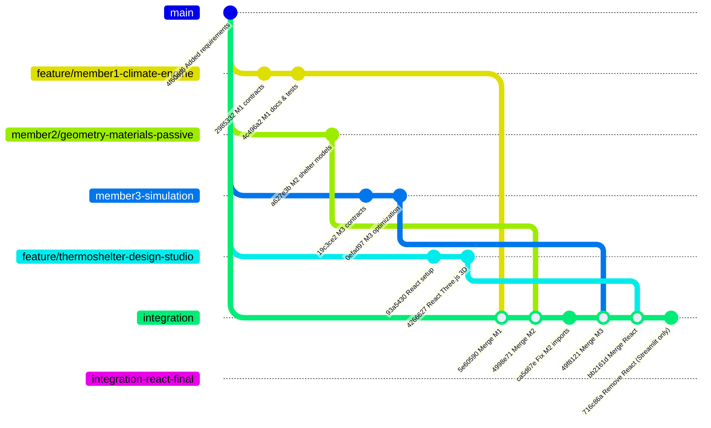
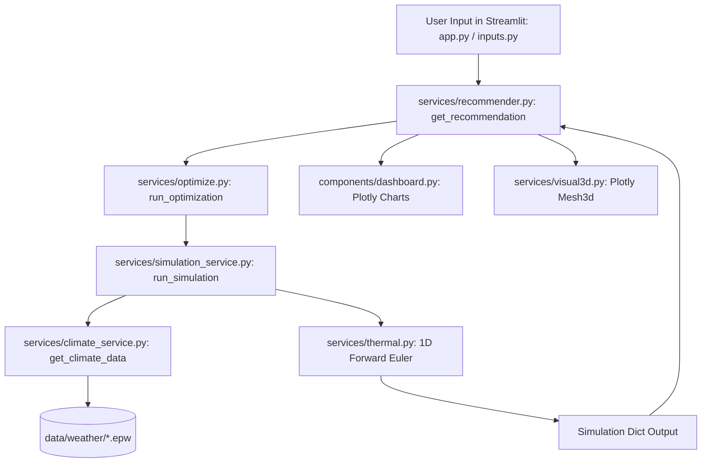
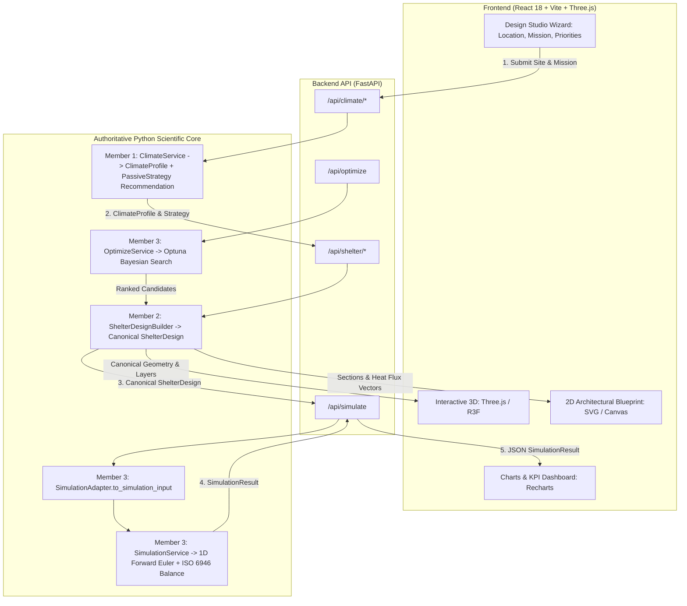

# ThermoShelter AI — Phase 0 Architecture Audit & Integration Blueprint
**Target Branch:** `integration-react-final`  
**Date:** September 2026  
**Auditor:** Antigravity Integration Agent  
**Status:** READ-ONLY AUDIT COMPLETE — Awaiting Phase 1 Authorization  

---

## 1. Executive Summary

ThermoShelter AI is an area-specific passive shelter design platform built to deliver thermal comfort in extreme and diverse climates (hero demo: high-altitude cold of Leh, Ladakh; alongside hot-arid Jaisalmer, warm-humid Chennai, composite Delhi, and temperate Bengaluru). The system combines transient building physics (1D Forward Euler numerical heat balance, ISO 6946 multi-layer envelope conduction), multi-objective Bayesian optimization (Optuna TPE), and architectural visualization.

Six sub-teams (Members 1 through 6) developed specialized modules across individual git feature branches. In prior commits, an integration branch merged the backend contributions of Member 1 (`feature/member1-climate-engine`), Member 2 (`member2/geometry-materials-passive`), Member 3 (`member3-simulation`), and Member 4 (`feature/thermoshelter-design-studio`). However, commit `716c86a` (`Remove React frontend and standardize Streamlit application`) deleted the React frontend directory (`thermoshelter-design-studio/`), forcing the system to rely temporarily on an ad-hoc Streamlit interface (`app.py` and `components/`).

This audit establishes the definitive baseline on `integration-react-final` to rebuild ThermoShelter according to a clean, decoupled, production-grade architecture:
- **Presentation & Interaction (Member 4):** React 18 + Vite + Tailwind CSS + Three.js / React Three Fiber + 2D Architectural SVG/Canvas Blueprint.
- **Backend Bridge:** FastAPI REST API providing strictly typed JSON schemas with validation, streaming simulation endpoints, and asynchronous optimization dispatch.
- **Scientific Source of Truth (Members 1, 2, 3):** Authoritative Python physics engines, ISO 6946 multi-layer conduction models, forward Euler solvers, and Optuna multi-objective optimization.

A critical finding of this audit is that the React frontend in `thermoshelter-design-studio` previously implemented an independent, client-side, pseudoscientific thermal simulation in TypeScript (`src/utils/thermalEngine.ts`) with hardcoded sinusoidal formulas, heuristic offsets, and synthetic results. In the rebuilt architecture, all physics calculations remain exclusively in Python, and React acts purely as a consumer of validated backend simulation contracts.

---

## 2. Current Repository Architecture

The current working tree of `integration-react-final` contains 59 tracked files organized as follows:

```
sih-area-specific-shelter/
├── .streamlit/
│   └── config.toml                       # Streamlit visual theme configuration
├── backend/
│   └── climate/                          # Member 1: Climate intelligence engine
│       ├── __init__.py
│       ├── api.py                        # Framework-agnostic HTTP/RPC dispatchers
│       ├── climate_cache.py              # In-memory LRU caching for weather payloads
│       ├── climate_classifier.py         # 6-zone rule-based climate classification
│       ├── climate_resolver.py           # Solar/meteorological normalizer
│       ├── climate_strategy.py           # Passive architectural strategy engine
│       ├── location_resolver.py          # Geocoding and offline coordinate resolver
│       ├── schemas.py                    # Pydantic v2 domain schemas (ClimateProfile, etc.)
│       ├── service.py                    # ClimateService central orchestrator
│       └── weather_provider.py           # Open-Meteo API + offline EPW/CSV fallback
├── components/                           # Streamlit UI presentation layer
│   ├── __init__.py
│   ├── chart_theme.py                    # Plotly design theme & typography
│   ├── charts.py                         # Plotly 2D charts & 2D floorplan diagram
│   ├── comparison.py                     # Baseline vs Optimized Streamlit view
│   ├── dashboard.py                      # Simulation KPI cards & hourly plots
│   ├── export.py                         # JSON/CSV design export helper
│   ├── feature_studio.py                 # Multi-tab studio coordinator
│   ├── inputs.py                         # Parameter sliders and input forms
│   ├── recommendations.py                # Envelope specs & ranked candidate cards
│   ├── shelter_3d.py                     # Plotly 3D and 2D floorplan wrapper
│   └── validation.py                     # Physical assumptions & disclaimer cards
├── data/
│   ├── climate/
│   │   ├── locations.json                # Predefined city coordinates & metadata
│   │   └── weather.csv                   # Historical hourly ambient & solar data
│   ├── materials/
│   │   ├── glazing.json                  # Glazing optical and thermal properties
│   │   └── materials.json                # Opaque envelope material thermophysical properties
│   ├── mock/                             # Mock dataset fixtures for decoupled testing
│   │   ├── README.md
│   │   ├── chennai_climate.json
│   │   ├── jaisalmer_climate.json
│   │   ├── leh_climate.json
│   │   ├── mock_material_assembly.json
│   │   ├── mock_passive_strategy.json
│   │   ├── mock_shelter_design_hot_dry.json
│   │   ├── mock_shelter_design_leh.json
│   │   ├── mock_shelter_geometry.json
│   │   └── mock_shelter_requirements.json
│   ├── shelters/
│   │   └── templates.json                # Baseline shelter dimension presets
│   └── weather/                          # EnergyPlus Weather (.epw) files
│       ├── bengaluru.epw
│       ├── chennai.epw
│       ├── delhi.epw
│       ├── jaisalmer.epw
│       └── leh.epw
├── docs/                                 # Technical documentation
│   ├── data_dictionary.md                # Global data schema dictionary
│   ├── equations.md                      # Physical equations & heat balance derivations
│   ├── MEMBER1_CLIMATE_ENGINE.md         # Member 1 climate specification
│   ├── member2_specification.md          # Member 2 geometry/materials specification
│   └── integration/
│       └── member2-integration.md        # Member 2 integration handoff notes
├── scripts/
│   └── validate_data.py                  # CLI data validation script
├── services/                             # Domain services & physics calculation engines
│   ├── __init__.py                       # Package exports and aliases
│   ├── climate_service.py                # Legacy weather loader + M1 service bridge
│   ├── comfort.py                        # Degree-hours & adaptive comfort formulas
│   ├── contracts.py                      # Member 3 shared dataclass contracts & adapters
│   ├── fixtures.py                       # Test fixtures for simulation & optimization
│   ├── formula_constants.py              # Physical constants (air density, Stefan-Boltzmann)
│   ├── formulas.py                       # Unified mathematical formula facade
│   ├── geometry.py                       # Pure geometry functions (areas, volumes)
│   ├── material_service.py               # Material catalog lookup service
│   ├── optimize.py                       # Optuna TPE multi-objective Bayesian optimizer
│   ├── recommender.py                    # Rule-based auto-sizing & baseline generator
│   ├── simulation_adapter.py             # SimulationAdapter bridging M1/M2 to M3
│   ├── simulation_service.py             # Authoritative 168-hr transient simulation engine
│   ├── solar.py                          # Solar geometry, incidence & solar gain formulas
│   ├── thermal.py                        # ISO 6946 resistances, capacitances & Euler step
│   ├── thermal_engine.py                 # Legacy 62-line Matplotlib prototype runner
│   ├── ventilation.py                    # Airflow & ventilation heat loss formulas
│   ├── visual3d.py                       # Plotly Mesh3d architectural model generator
│   ├── shelter/                          # Member 2: Geometry, envelope, passive systems
│   │   ├── __init__.py
│   │   ├── builder.py                    # ShelterDesignBuilder & archetype factories
│   │   ├── envelope_engine.py            # Multi-layer assemblies, ISO 6946 U-values
│   │   ├── geometry_engine.py            # Parametric geometry & boundary metrics
│   │   ├── models.py                     # Canonical ShelterDesign domain models
│   │   └── passive_systems.py            # Passive architectural strategies catalog
│   └── tests/                            # Member 3 subsystem test suite
│       ├── test_contracts.py
│       ├── test_formulas.py
│       ├── test_optimization.py
│       ├── test_simulation_adapter.py
│       ├── test_simulation_service.py
│       ├── test_thermal_physics.py
│       └── test_visual3d.py
├── tests/                                # Root test suite
│   ├── climate/                          # Member 1 test suite
│   │   ├── __init__.py
│   │   ├── test_climate_classifier.py
│   │   ├── test_climate_resolver.py
│   │   ├── test_climate_service.py
│   │   ├── test_climate_strategy.py
│   │   ├── test_golden_scenario.py
│   │   ├── test_location_resolver.py
│   │   ├── test_schemas.py
│   │   └── test_weather_provider.py
│   ├── test_chart_and_validation.py
│   ├── test_data_loader.py
│   ├── test_data_validation.py
│   ├── test_member2_subsystem.py
│   ├── test_optimization_and_recommender.py
│   └── test_temporary_vs_permanent.py
├── app.py                                # Streamlit application entry point
├── data_loader.py                        # Dataset loading utilities
├── requirements.txt                      # Python dependencies
└── README.md
```

---

## 3. Branch/Team Architecture

An inspection of git commit history and remote tracking references reveals the following structural lineage:



### Git Branch Summary:
1. `main` (`origin/main`, `origin/HEAD`): Anchored at commit `6108143` (reverted premature Design Studio merge). Stable baseline without merged member features.
2. `feature/member1-climate-engine`: Contains Member 1's climate intelligence engine (`backend/climate/`, `tests/climate/`, `docs/MEMBER1_CLIMATE_ENGINE.md`).
3. `member2/geometry-materials-passive`: Contains Member 2's parametric geometry, multilayer envelope, passive systems, builder, mock fixtures, and `services/shelter/`.
4. `member3-simulation`: Contains Member 3's simulation engine, Optuna multi-objective optimization, `services/contracts.py`, `services/simulation_adapter.py`, and `services/tests/`.
5. `feature/thermoshelter-design-studio`: Contains Member 4's complete React/Vite/Three.js frontend in `thermoshelter-design-studio/`.
6. `integration`: Represents the previous integration staging branch where all four subsystems were merged (`bb2161d`), followed immediately by commit `716c86a` which stripped the React folder.
7. `integration-react-final` (Current Working Branch): Currently pointing to commit `716c86a`. The React frontend codebase is fully intact in the git tree at commit `bb2161d` and on `origin/feature/thermoshelter-design-studio`.

---

## 4. Member Ownership

| Member | Domain Responsibility | Implemented Code on Branch | Status & Codebase Location |
| :--- | :--- | :--- | :--- |
| **Member 1** | Climate Engine, Weather Providers, 6-Zone Classifier, Passive Strategy Priorities | `backend/climate/*`, `services/climate_service.py`, `tests/climate/*`, `data/mock/*_climate.json`, `docs/MEMBER1_CLIMATE_ENGINE.md` | Fully present. Requires `pydantic>=2.0` in environment. |
| **Member 2** | Parametric Geometry, Multilayer Envelope Assemblies, Passive Architectural Systems | `services/shelter/*` (`models.py`, `builder.py`, `geometry_engine.py`, `envelope_engine.py`, `passive_systems.py`), `tests/test_member2_subsystem.py`, `docs/member2_specification.md`, `data/mock/mock_shelter_*.json` | Fully present. 31/31 unit tests passing. |
| **Member 3** | Thermal Digital Twin, Forward Euler Solver, Optuna Bayesian Optimizer | `services/contracts.py`, `services/simulation_service.py`, `services/optimize.py`, `services/simulation_adapter.py`, `services/thermal.py`, `services/formulas.py`, `services/tests/*` | Fully present. 116/116 unit tests passing. |
| **Member 4** | React Frontend, Interactive 3D (Three.js), 2D Architectural Blueprint | `thermoshelter-design-studio/` (React, Vite, Drei, Recharts, Tailwind, Lucide) | Deleted in commit `716c86a`; preserved in `bb2161d` and `origin/feature/thermoshelter-design-studio`. Needs restoration and API integration. |
| **Member 5** | Integration, QA Validation, Regression Pipelines | Test suites (`services/tests/`, `tests/`), CI test harnesses, integration adapter contracts | Active on this branch. |
| **Member 6** | Documentation, Physical Equations, Scientific Verification | `docs/equations.md`, `docs/data_dictionary.md`, `scripts/validate_data.py`, `tests/test_data_validation.py` | Fully present. |

---

## 5. Current Data Flow

The current data flow in the Streamlit runtime operates as a semi-coupled monolithic loop:



### Current Data Flow Deficiencies:
1. **Bypasses Member 1:** `services/climate_service.py` directly parses EPW or CSV data; it does not invoke `backend.climate.service.ClimateService` or `LocationResolver`.
2. **Bypasses Member 2:** Sizing and materials are generated using simple dictionary lookups in `services/recommender.py` rather than constructing Member 2's rich `services.shelter.models.ShelterDesign` or using `ShelterDesignBuilder`.
3. **Parameter Collapse:** `run_simulation()` consumes a flat parameter list (single wall material, single insulation layer, aggregate window area, scalar orientation factor). Multilayer envelopes, individual fenestration apertures, dedicated thermal mass elements, and passive strategies are omitted.
4. **No API Layer:** Streamlit directly calls internal service functions in process.
5. **No React Connection:** The React frontend is absent from the active working tree.

---

## 6. Proposed Final Data Flow

The target decoupled architecture establishes Python as the single authoritative scientific source of truth and React as the presentation/visualization engine:



---

## 7. ShelterDesign Contract Conflict

The most critical architectural tension in the repository exists between two competing representations of `ShelterDesign`:

### 7.1 Representation A: Member 2 Canonical Physical Model (`services/shelter/models.py`)
```python
@dataclass
class ShelterDesign:
    design_id: str
    name: str
    requirements: ShelterRequirements
    geometry: ShelterGeometry
    wall_assembly: MaterialAssembly
    roof_assembly: MaterialAssembly
    floor_assembly: MaterialAssembly
    glazing: GlazingDefinition
    door_assembly: Optional[MaterialAssembly] = None
    openings: List[OpeningDefinition] = field(default_factory=list)
    zones: List[ZoneDefinition] = field(default_factory=list)
    thermal_mass_elements: List[ThermalMassDefinition] = field(default_factory=list)
    passive_strategies: List[PassiveStrategy] = field(default_factory=list)
    version: str = "1.0.0"
    created_at: str = ...
    metadata: Dict[str, Any] = field(default_factory=dict)
```
- **Nature:** Highly detailed, hierarchically structured domain model representing the complete physical and architectural digital twin of the shelter.
- **Envelope Rigor:** Full ISO 6946 multilayer series resistance, layer thicknesses in meters, thermal conductivities, volumetric densities, specific heat capacities, surface film resistances, and areal heat capacities.
- **Spatial Fenestration:** Individual openings (`OpeningDefinition`) mapped to specific facades (North, South, East, West, Roof) with explicit azimuths, shading factors, overhang depths, operability flags, and ventilation roles.
- **Sensible Storage:** Explicit `ThermalMassDefinition` elements (Trombe walls, mass cores, heavy floor slabs) with physical volume, mass, and total thermal capacitance ($J/K$).

### 7.2 Representation B: Member 3 Simulation-Oriented Flat Contract (`services/contracts.py`)
```python
@dataclass
class ShelterDesign:
    length: float = 4.0
    width: float = 3.0
    height: float = 2.8
    wall_material: str = "brick"
    wall_thickness_m: float = 0.23
    insulation_thickness_m: float = 0.0
    insulation_conductivity: float = 0.025
    roof_type: str = "flat"
    pitch_angle_deg: float = 30.0
    roof_thickness_m: float = 0.15
    roof_conductivity: float = 0.50
    roof_insulation_m: float = 0.0
    window_area: float = 2.0
    glazing: str = "double_clear"
    shgc: Optional[float] = None
    orientation: Union[str, float] = "south"
    ach: float = 1.0
    occupants: int = 2
    shelter_type: str = "Permanent"
    shelter_model: Optional[str] = None
    heat_per_person: float = 100.0
```
- **Nature:** Flat, lumped-parameter parameter bag tailored for rapid argument passing into the explicit Euler solver and Optuna trial generation.
- **Deficiencies:** Drops multilayer wall configurations (assumes 1 base material + 1 insulation layer); drops dedicated thermal mass objects; collapses all windows into a single aggregated `window_area` facing a single cardinal `orientation`; ignores architectural zones and passive systems.

### 7.3 Adapter Failure in Current Codebase
In `services/contracts.py` (lines 824–836) and `services/simulation_adapter.py` (line 65):
```python
def adapt_to_shelter_design(raw_data: Union[ShelterDesign, Dict[str, Any]]) -> ShelterDesign:
    if isinstance(raw_data, ShelterDesign):
        return raw_data
    elif type(raw_data).__name__ == "ShelterDesign" and hasattr(raw_data, "to_dict"):
        return ShelterDesign.from_dict(raw_data.to_dict())
    elif isinstance(raw_data, dict):
        return ShelterDesign.from_dict(raw_data)
```
When Member 2's `ShelterDesign` is passed into `adapt_to_shelter_design()`, `raw_data.to_dict()` produces a dictionary structured under nested keys (`geometry`, `wall_assembly`, `requirements`). However, Member 3's `ShelterDesign.from_dict()` expects top-level keys (`length`, `width`, `wall_material`). Because top-level keys are absent, **all values silently fall back to defaults (length=4.0, width=3.0, wall_material="brick", insulation=0.0)**. The actual design submitted by Member 2 is discarded.

### 7.4 Architectural Recommendation
1. **Declare Member 2's `services.shelter.models.ShelterDesign` as the single canonical domain model** for ThermoShelter.
2. **Re-classify Member 3's flat `ShelterDesign` in `services/contracts.py` as `SimulationEnvelopeParameters` or internal `SimulationInput` fields.**
3. **Upgrade `services/simulation_adapter.py`** to extract multi-layer U-values, total thermal capacitance, directional window areas, and passive ventilation parameters directly from Member 2's canonical model.

---

## 8. Climate Architecture

### 8.1 Existing Implementation
- **Author:** Member 1 (`backend/climate/`).
- **Core Components:**
  - `LocationResolver` (`backend/climate/location_resolver.py`): Matches user queries against `data/climate/locations.json` or parses decimal coordinate tuples with bounds checking (lat $[-90, 90]$, lon $[-180, 180]$).
  - `WeatherProvider` (`backend/climate/weather_provider.py`): Hierarchical provider pipeline. Attempts live Open-Meteo REST API queries; falls back automatically to local EPW files via `pvlib.iotools.read_epw` in `data/weather/` (`leh.epw`, `jaisalmer.epw`, `chennai.epw`, `delhi.epw`, `bengaluru.epw`), and finally to `data/climate/weather.csv`.
  - `ClimateCache` (`backend/climate/climate_cache.py`): TTL-based cache preventing redundant remote API calls.
  - `ClimateClassifier` (`backend/climate/climate_classifier.py`): Deterministic 6-zone classification (`EXTREME COLD`, `COLD`, `HOT DRY`, `HOT HUMID`, `TEMPERATE`, `VARIABLE`) driven by heating degree days (HDD18), cooling degree days (CDD18), annual GHI, relative humidity, and diurnal range.
  - `ClimateStrategyEngine` (`backend/climate/climate_strategy.py`): Maps classified zones to qualitative passive design rules and priorities (`PriorityLevel.HIGH/MODERATE/LOW` for solar capture, thermal mass, insulation, airlocks).
  - `ClimateAPI` (`backend/climate/api.py`): Framework-agnostic controller handlers.

### 8.2 Integration Status & Defects
- `backend/climate/schemas.py` requires Pydantic v2 (`from pydantic import BaseModel, Field, field_validator, ConfigDict`), which is currently missing from `requirements.txt`.
- `services/climate_service.py` duplicates EPW parsing logic in `get_climate_data()` using an ad-hoc implementation instead of delegating to `backend.climate.service.default_climate_service`.
- In Streamlit (`components/feature_studio.py`), climate selection is hardcoded to a static list of 5 cities rather than dynamic location resolution.

---

## 9. Geometry Architecture

### 9.1 Existing Implementation
Two independent implementations exist:
1. **Legacy Geometric Module (`services/geometry.py`):** Pure functions calculating rectangular floor area ($L \cdot W$), wall area ($2(L+W)H$), flat roof area ($L \cdot W$), and simple pitched roof geometry with gables.
2. **Member 2 Parametric Engine (`services/shelter/geometry_engine.py`):**
   - Object-oriented parametric models (`ShelterGeometry`, `OpeningDefinition`, `ZoneDefinition`).
   - Boundary surface-to-volume calculations ($S/V$ ratio, window-to-wall ratio).
   - Facade-specific wall area breakdown (`facade_wall_areas: {"north": ..., "south": ..., "east": ..., "west": ...}`).
   - Net opaque area calculation per facade subtracting fenestration located on that specific wall.
   - Factory generators for design archetypes: `create_compact_geometry()` (cold climates), `create_elongated_geometry()` (solar orientation / cross-ventilation), and `create_pitched_roof_geometry()`.

### 9.2 Reconciliation
`services/shelter/geometry_engine.py` already imports and reuses `services.geometry` internally. It represents the superset of geometric capabilities and should be the sole geometry engine used across the application.

---

## 10. Material Architecture

### 10.1 Existing Implementation
- **Database:** `data/materials/materials.json` contains 15 curated construction materials with complete thermophysical properties:
  - Density ($\rho$, $\text{kg/m}^3$)
  - Thermal conductivity ($k$, $\text{W/(m}\cdot\text{K)}$)
  - Specific heat capacity ($c_p$, $\text{J/(kg}\cdot\text{K)}$)
  - Emissivity ($\epsilon$) and solar absorptivity ($\alpha$)
  - Embodied energy ($\text{MJ/kg}$) and cost estimates.
- **Glazing Database:** `data/materials/glazing.json` defines single, double, triple, and low-E systems with $U$-values and SHGC.
- **Service Layer (`services/material_service.py`):** Provides lookup, caching, and filtering by permanence (`temporary` vs `permanent`).
- **Multilayer Envelope Engine (`services/shelter/envelope_engine.py`):**
  - Instantiates `MaterialLayer` records linked to the database.
  - Assembles layers into `MaterialAssembly` (wall, roof, floor, door).
  - Computes composite thermal resistance according to ISO 6946:
    $$R_{\text{total}} = R_{si} + \sum_{i=1}^n \frac{d_i}{k_i} + R_{se}$$
    $$U = \frac{1}{R_{\text{total}}}$$
  - Computes total areal mass ($\text{kg/m}^2$) and areal thermal capacitance ($\text{J/(m}^2\cdot\text{K)}$).

### 10.2 Defect in Simulation Handoff
In `services/simulation_service.py` (lines 266–285), the simulation engine bypasses Member 2's `MaterialAssembly` and recomputes a simplified 2-layer wall $U$-value (`base_material` + `insulation`) using hardcoded surface resistances, while the floor $U$-value is hardcoded to $1.20 \text{ W/(m}^2\cdot\text{K)}$ with 0.15m thickness. The full multi-layer envelope properties constructed by Member 2 are lost.

---

## 11. Passive Systems Architecture

### 11.1 Existing Implementations
1. **Member 1 (`backend/climate/climate_strategy.py`):** Produces qualitative architectural priorities based on macro-climate data (e.g., Extreme Cold requires high solar capture, continuous insulation, entry airlocks, thermal buffers).
2. **Member 2 (`services/shelter/passive_systems.py`):** Implements physical, quantifiable architectural systems:
   - Cold Region: `high_performance_insulation`, `direct_solar_gain_south_aperture`, `sensible_thermal_mass_storage`, `entry_airlock_vestibule`, `buffer_zone_layout`, `controlled_low_rate_ventilation`.
   - Hot-Dry: `night_purge_ventilation`, `daytime_solar_exclusion_shading`, `precooled_thermal_mass`.
   - Hot-Humid: `cross_ventilation_pathways`, `solar_reflective_envelope`, `generous_overhang_shading`.
   - Variable: `mixed_mode_operable_vents`, `seasonal_adjustable_shading`.

### 11.2 Integration Gap
These passive strategy objects are defined with concrete physical parameters (e.g., `airlock_depth_m: 1.5`, `infiltration_reduction_factor: 0.65`, `south_window_to_wall_ratio: 0.25`, `minimum_capacitance_j_per_k: 5000000.0`), but **they are not mapped into `services/simulation_service.py:run_simulation()`**. The simulation solver executes with fixed, unadjusted infiltration rates and ignores airlocks, shading overhangs, and nighttime purge schedules.

---

## 12. Simulation Architecture

### 12.1 Mathematical Solver
The simulation core in `services/simulation_service.py` and `services/thermal.py` implements a 1-dimensional lumped-capacitance transient heat balance solved via explicit Forward Euler numerical integration:

$$C_{\text{total}} \frac{dT_{\text{in}}}{dt} = Q_{\text{cond}} + Q_{\text{vent}} + Q_{\text{solar}} + Q_{\text{int}} - Q_{\text{rad,sky}}$$

Where:
- Conductive heat exchange across envelope components:
  $$Q_{\text{cond}} = \left( U_{\text{wall}} A_{\text{wall}} + U_{\text{roof}} A_{\text{roof}} + U_{\text{floor}} A_{\text{floor}} + U_{\text{glass}} A_{\text{glass}} \right) (T_{\text{out}}(t) - T_{\text{in}}(t))$$
- Convective infiltration and ventilation heat loss:
  $$Q_{\text{vent}} = \frac{\text{ACH} \cdot V \cdot \rho_{\text{air}} c_{p,\text{air}}}{3600} (T_{\text{out}}(t) - T_{\text{in}}(t))$$
- Direct and diffuse solar heat gain through fenestration:
  $$Q_{\text{solar}} = (I_{\text{direct}}(t) + I_{\text{diffuse}}(t)) \cdot A_{\text{glass}} \cdot \text{SHGC} \cdot f_{\text{orientation}}$$
- Internal heat gain from occupants:
  $$Q_{\text{int}} = N_{\text{occupants}} \cdot q_{\text{person}}$$
- Longwave radiation exchange between exterior roof surface and sky:
  $$Q_{\text{rad,sky}} = \sigma \epsilon_{\text{roof}} A_{\text{roof}} (T_{\text{in}}^4 - T_{\text{sky}}^4)$$
- Explicit Euler state update:
  $$T_{\text{in}}(t + \Delta t) = T_{\text{in}}(t) + \frac{\Delta t}{C_{\text{total}}} \sum Q(t)$$
  With $\Delta t = \frac{3600}{\text{substeps}} = \frac{3600}{60} = 60 \text{ s}$.

### 12.2 Numerical Stability
Explicit Euler stability requires $\Delta t < \frac{C_{\text{total}}}{\sum UA + UA_{\text{vent}}}$. With $C_{\text{total}} \approx 10^7 \text{ J/K}$ and $\sum UA \approx 200 \text{ W/K}$, the critical time step is $\tau \approx 50{,}000 \text{ s}$. At $\Delta t = 60 \text{ s}$, the simulation operates well within the numerical stability limit, verified in `services/tests/test_thermal_physics.py`.

### 12.3 Parameter Lineage & Traceability Matrix

| Parameter | Source | Representation in Design | Transformation / Adapter | Destination in Simulation | Affects Equations? | Defect / Note |
| :--- | :--- | :--- | :--- | :--- | :--- | :--- |
| **Climate Weather** | M1 `ClimateProfile` / EPW | Hourly Arrays (`T`, `DNI`, `DHI`, `WS`, `RH`) | `adapt_to_climate_profile()` | `run_simulation()` input arrays | **YES** | Directly drives ambient boundary condition & solar gains. |
| **Outdoor Temp** | `ClimateProfile` | `hourly_temperature: List[float]` | None | `t_out = outdoor_temps[h]` | **YES** | Drives $\Delta T = T_{\text{out}} - T_{\text{in}}$. |
| **Solar Radiation** | `ClimateProfile` | `hourly_direct_solar`, `hourly_diffuse_solar` | Summed: `DNI + DHI` | `q_solar` calculation | **YES** | Solar hitting walls/roof is ignored; only enters via windows. |
| **Occupants** | M2 `ShelterRequirements` | `occupants: int` | Direct scalar | `q_internal = occupants * heat_per_person` | **YES** | Modeled as constant heat gain throughout 168 hours. |
| **Dimensions (L, W, H)** | M2 `ShelterGeometry` | `length_m`, `width_m`, `height_m` | M3 adapter drops keys if nested | `calculate_floor_area()`, `calculate_volume()` | **YES** | Drives surface areas and enclosed air volume. |
| **Wall Area** | Derived | `gross_wall_area_m2`, `net_wall_area_m2` | Collapsed to single scalar | `solid_wall_area = gross - window` | **YES** | M2 facade-specific wall areas are aggregated into one lump. |
| **Roof Area** | Derived | `roof_area_m2` | Formula or flat area | `ua_roof = u_roof * roof_area` | **YES** | Pitch angle alters area for pitched models. |
| **Floor Area** | Derived | `floor_area_m2` | $L \cdot W$ | `ua_floor = u_floor * floor_area` | **YES** | Assumes floor heat loss couples directly to $T_{\text{out}}$. |
| **Windows / Glazing Area** | M2 `openings` | `List[OpeningDefinition]` | **Collapsed to single `window_area` scalar** | `ua_windows`, `q_solar` | **YES** | **LOST:** Facade distributions, overhang shading, operability. |
| **Glazing Type / SHGC** | M2 `glazing` | `GlazingDefinition` | Looked up in `GLAZING_PROPERTIES` | `u_glass`, `effective_shgc` | **YES** | Passed as string identifier. |
| **Orientation** | M2 `orientation_deg` | Azimuth `[0, 360]` degrees | **Mapped to 4 strings: "south", "north", ...** | Scalar factor (S: 1.0, N: 0.45, E: 0.70, W: 0.75) | **YES** | **LOST:** True angular solar geometry and non-cardinal headings. |
| **Wall Materials / Layers**| M2 `wall_assembly` | `MaterialAssembly` (Multilayer) | **Collapsed to 1 base material + 1 insulation** | `calculate_assembly_u_value()` | **PARTIAL**| **LOST:** Intermediate layers, cavity air gaps, exterior rainscreens. |
| **Insulation Thickness** | M2 `MaterialLayer` | `thickness_m: float` | Passed as `insulation_thickness_m` | Adds $d/k$ to $R_{\text{total}}$ | **YES** | Successfully lowers $U$-value. |
| **Roof Assembly** | M2 `roof_assembly` | `MaterialAssembly` (Multilayer) | Collapsed to 3 scalars ($d$, $k$, $d_{\text{ins}}$) | `calculate_assembly_u_value()` | **PARTIAL**| Multilayer configurations dropped. |
| **Floor Assembly** | M2 `floor_assembly`| `MaterialAssembly` | **IGNORED COMPLETELY** | **Hardcoded $k=1.20$, $d=0.15$** | **HARDCODED**| **LOST:** Ground insulation or raised floor specs are discarded. |
| **Ventilation / ACH** | M2 `PassiveStrategy` | Strategy parameters | Passed as scalar `ach: float` | `ua_vent = (ACH * V * \rho * c_p) / 3600` | **YES** | Constant ACH across all 168 hours; dynamic airflow absent. |
| **Thermal Mass** | M2 `thermal_mass_elements` | `List[ThermalMassDefinition]` | **IGNORED COMPLETELY** | Recomputed from base wall density | **PARTIAL**| **LOST:** Trombe walls and internal storage cores omitted. |
| **Internal Gains** | Configuration | `heat_per_person: float` (100 W) | Multiplied by occupants | `q_internal` in Watts | **YES** | Constant rate. |
| **Passive Strategies** | M2 `passive_strategies`| `List[PassiveStrategy]` | **NOT PASSED TO SIMULATION** | N/A | **ZERO** | **LOST:** Shading, airlocks, and purge ventilation dropped. |

---

## 13. Optimization Architecture

### 13.1 Optimizer Structure
- **Engine (`services/optimize.py`):** Uses Optuna TPE (Tree-structured Parzen Estimator) for multi-objective optimization over design candidates.
- **Decision Variables in `_objective()`:**
  1. `insulation_thickness_m`: Continuous float in $[0.0, 0.25]$ (step 5mm).
  2. `window_area`: Continuous float in $[0.5, \min(12.0, A_{\text{wall}} \cdot 0.40)]$ (step 0.25 m²).
  3. `wall_material`: Categorical selection (`brick`, `stone_granite`, `timber_wood`, `mud_adobe`, `puf_insulation`, etc.).
  4. `glazing`: Categorical selection (`single_clear`, `double_clear`, `double_low_e`, `triple_low_e`).
  5. `orientation`: Categorical selection (`south`, `north`, `east`, `west`).
- **Objective Formulation:**
  - Evaluates 168-hour simulation for each trial candidate.
  - Objective: Minimize discomfort degree hours ($DH$) + penalized heat loss:
    $$\text{Score}_{\text{permanent}} = DH + 0.35 \cdot Q_{\text{loss,kWh}}$$
    $$\text{Score}_{\text{temporary}} = DH + 0.15 \cdot Q_{\text{loss,kWh}} + 0.05 \cdot \max(0, \frac{\rho_{\text{mat}} - 100}{100})$$
    (Temporary shelters penalize heavy materials for logistics and rapid deployment).
- **Candidate Output:**
  Produces ranked candidates (#1 Best Overall, #2 High Performance / Thermal Mass, #3 Rapid Assembly / Lightweight) packaged into `OptimizationResult` contracts.

### 13.2 Deficiencies
- Shelter dimensions ($L, W, H$) and roof geometry are fixed and not searched.
- Passive strategies (airlocks, Trombe walls, shading overhangs) are not part of the search space.
- The output `OptimizationResult` produces parameter values but **lacks a generator function to synthesize a full canonical Member 2 `ShelterDesign`**.

---

## 14. React Frontend Architecture

### 14.1 Status & Structure (from Commit `bb2161d`)
The React application is structured under `thermoshelter-design-studio/`:
- **Build Tooling:** Vite 5.0.8, TypeScript 5.3.3, Tailwind CSS 3.4.0, PostCSS, Autoprefixer.
- **Dependencies:** React 18.2.0, `@react-three/fiber` (8.17.10), `@react-three/drei` (9.117.3), `three` (0.186.0), `recharts` (2.10.3), `lucide-react` (0.294.0).
- **Key Modules:**
  - `src/App.tsx`: Tab-based navigation (`studio`, `dashboard`, `climate`, `design`, `results`, `compare`).
  - `src/components/DesignStudio.tsx`: 7-step guided wizard (`location` $\rightarrow$ `mission` $\rightarrow$ `priorities` $\rightarrow$ `resources` $\rightarrow$ `review` $\rightarrow$ `generating` $\rightarrow$ `results`).
  - `src/components/ShelterModel3D.tsx`: Interactive Three.js/R3F WebGL viewport with OrbitControls, directional sun path animation, and thermal comfort glow.
  - `src/components/SimulationResults.tsx`: Recharts AreaChart for hourly temperatures, BarChart for heat losses, PieChart for balance.
  - `src/components/ComparativeAnalysis.tsx`: Material comparison bar charts.
  - `src/components/ShelterDesigner.tsx`: Manual dimension, material, and fenestration sliders.
  - `src/components/ClimateInput.tsx`: City presets and weather parameter inputs.
  - `src/data/climatePresets.ts` & `src/data/materials.ts`: Static client-side datasets.

### 14.2 Critical Architectural Defect: Client-Side TypeScript Physics
`src/utils/thermalEngine.ts` (252 lines) implements an independent, duplicate, client-side simulation engine:
- Computes $U$-values in TypeScript with hardcoded film resistances ($R_i=0.13, R_e=0.04$).
- Simulates indoor temperatures using empirical heuristics:
  $$\text{shelterEffect} = \begin{cases} \min(12, \frac{\text{netBalance}}{500}) & \text{if netBalance} > 0 \\ \max(-5, \frac{\text{netBalance}}{300}) & \text{otherwise} \end{cases}$$
  $$T_{\text{avg,inside}} = T_{\text{avg,ambient}} + \text{shelterEffect} + 5$$
- Synthesizes 24-hour sinusoidal temperatures:
  $$T_{\text{ambient}}(h) = T_{\text{avg}} + \frac{\Delta T}{2} \sin\left(\frac{(h - 9)\pi}{12}\right)$$
- Synthesizes 12 monthly temperatures with hardcoded offsets: `[-8, -5, -1, 4, 8, 12, 14, 13, 9, 4, -2, -6]`.
- Implements client-side mock design generation using `setTimeout(..., 2000)` in `DesignStudio.tsx`.

**Architectural Requirement:** `thermalEngine.ts` must be stripped of all physics calculations and converted into a typed API client consuming FastAPI simulation and optimization endpoints.

---

## 15. Streamlit Architecture

The existing Streamlit application in `app.py` and `components/` contains both UI presentation logic and valuable scientific workflows:

| File | Primary Role | Logic Classification | Future Action |
| :--- | :--- | :--- | :--- |
| `app.py` | UI layout, CSS injection, studio routing | **B: UI Logic** | Replaced by React `App.tsx`. Preserve as legacy fallback. |
| `components/inputs.py` | Sliders for city, people, permanence | **B: UI Logic** | Replaced by React Design Studio wizard. |
| `components/dashboard.py` | Plotly KPI metric cards & timeseries graphs | **C: Reference Implementation** | Replaced by React Recharts components. |
| `components/feature_studio.py` | Orchestrates 5 specialized design studios | **A: Scientific Logic / Orchestration** | Migrate orchestration logic into FastAPI endpoints (`/api/studios/*`). |
| `components/charts.py` | 13 Plotly chart generators (losses, comfort, diurnal) | **A: Scientific Logic & Vis** | Data structures preserved; plotting ported to Recharts. |
| `components/chart_theme.py` | Plotly layout formatting & styling | **B: UI Logic** | Replaced by Tailwind CSS & Recharts theme. |
| `components/comparison.py` | Baseline vs Optimized dual-simulation runner | **A: Scientific Logic** | Migrate business logic into FastAPI endpoint (`/api/compare`). |
| `components/recommendations.py`| Formats specifications & candidate cards | **B: UI Logic** | Replaced by React candidate cards. |
| `components/shelter_3d.py` | Mounts Plotly 3D and 2D floorplan | **C: Reference Implementation** | Replaced by Three.js & SVG Blueprint. |
| `components/validation.py` | Renders physics assumptions & disclaimers | **C: Reference Implementation** | Port markdown text to React info modals. |
| `components/export.py` | Downloads JSON/CSV design specifications | **A: Utility Logic** | Migrate to FastAPI file download endpoint (`/api/export/design`). |

---

## 16. 3D Architecture

### 16.1 Existing 3D Implementations
1. **Plotly Mesh3d (`services/visual3d.py`):**
   - 678 lines generating 3D parametric boxes for walls, gabled/shed roof meshes, ground terrain, window panels, and climate extras (snow caps for Leh, desert parapets for Jaisalmer, verandahs for Chennai).
   - Rendered server-side and transmitted as heavy Plotly JSON payloads to Streamlit.
2. **React Three Fiber / Three.js (`thermoshelter-design-studio/src/components/ShelterModel3D.tsx`):**
   - 551 lines of client-side WebGL rendering with OrbitControls, ContactShadows, ACESFilmicToneMapping, animated sun path directional light, and dynamic thermal glow point light.
   - Geometries: Rectangular, Cylindrical, Dome, and Pyramid.
   - Hardcoded aperture placements: front wall has 2 windows at $\pm L/4$, back wall has 1 window at center, door at origin.

### 16.2 Target 3D Architecture
The target 3D system will be based on **React Three Fiber (Three.js)** inside React, driven dynamically by Member 2's canonical `ShelterGeometry` and `openings`:
- Replace hardcoded window positions with dynamic placement computed from `OpeningDefinition` ($x, y, z$ coordinates, facade azimuth, width, height).
- Visually represent multi-layer envelope cutaways (exterior cladding, insulation core, interior masonry).
- Visualize dedicated thermal mass elements (Trombe walls, heavy floor slabs).
- Connect sun position directly to real solar azimuth/elevation calculated from weather timestamps.

---

## 17. 2D Blueprint Architecture

### 17.1 Existing Implementation
`components/charts.py:create_2d_floorplan()` generates a primitive 2D top-down diagram using Plotly shapes (one outer rectangle, one inner dashed perimeter rectangle, one south window segment, one orange door rectangle).

### 17.2 Missing Architectural Deliverables
The project currently lacks a real engineering-style 2D architectural blueprint system. Required components:
1. **Plan View:** Scaled top-down view showing interior partition zones (living, airlock vestibule, solar sunspace), wall thicknesses, opening widths, door swing arcs, and dimension witness lines.
2. **Elevations:** North, South, East, and West exterior elevations showing window sill/head heights, roof pitch slope triangles, eave/ridge heights, and solar shading overhangs.
3. **Cross Section:** Vertical cut through the building envelope revealing layered wall, floor, and roof strata with callout tags indicating layer material and thickness in millimeters.
4. **Engineering Annotations:** Heat-flux arrows (solar transmission $Q_{\text{solar}}$, winter conduction loss $Q_{\text{cond}}$, infiltration drafts $Q_{\text{vent}}$), North compass arrow, and project title block (design ID, date, climate zone, $U$-values).
5. **Implementation Mechanism:** High-precision SVG component in React (`Blueprint2D.tsx`) with instant vector export (SVG/PDF).

---

## 18. FastAPI Architecture

FastAPI does not yet exist in the repository. It must be introduced as the central backend API service bridging React and Python.

### 18.1 Target File Layout
```
backend/
├── main.py                               # FastAPI app initialization, CORS, middleware
├── config.py                             # Server settings, allowed origins, paths
└── routes/
    ├── __init__.py
    ├── climate.py                        # /api/climate: location search, profiles, classification
    ├── shelter.py                        # /api/shelter: requirements, archetypes, materials, assemblies
    ├── simulation.py                     # /api/simulate: 168-hr transient simulation execution
    ├── optimization.py                  # /api/optimize: Bayesian search dispatch & candidate ranking
    └── export.py                         # /api/export: PDF report generation, JSON/CSV exports
```

### 18.2 Architectural Principles
- **No Scientific Logic in Routes:** Routes must strictly validate request schemas, delegate execution to underlying domain services (`ClimateService`, `ShelterDesignBuilder`, `SimulationAdapter`, `optimize_shelter`), and return typed Pydantic response models.
- **Strict Typing:** Leverage existing Pydantic schemas from Member 1 (`backend/climate/schemas.py`) and dataclasses from Members 2 and 3.
- **CORS Support:** Pre-configured for Vite development (`http://localhost:5173`) and production frontend builds.

---

## 19. Duplicate Implementations

| Subsystem / Functionality | Implementation A | Implementation B | Implementation C | Reconciliation Decision |
| :--- | :--- | :--- | :--- | :--- |
| **Shelter Design Domain Model** | `services/shelter/models.py:ShelterDesign` (Hierarchical, physical, multilayer, openings, zones) | `services/contracts.py:ShelterDesign` (Flat, 1-layer wall, scalar window area, simulation-only) | `thermoshelter-design-studio/src/utils/thermalEngine.ts:ShelterDesign` (TypeScript interface) | **Preserve A** as canonical domain twin. **Adapt B** into `SimulationEnvelopeParameters`. **Align C** as TypeScript mirror of A. |
| **Geometry Calculation** | `services/geometry.py` (Pure functions: floor area, wall area, volume) | `services/shelter/geometry_engine.py` (Object-oriented: boundary metrics, facade wall areas, pitch) | `thermoshelter-design-studio/src/utils/thermalEngine.ts:calculateSurfaceAreas` | **Preserve B** as authoritative geometry engine (it already reuses A). **Deprecate C**. |
| **Thermal Resistances & $U$-Values** | `services/thermal.py:calculate_total_resistance` (Pure math formulas) | `services/shelter/envelope_engine.py:create_material_assembly` (ISO 6946 multi-layer engine) | `services/simulation_service.py:calculate_assembly_u_value` (Hardcoded 2-layer formula) | **Preserve B** for envelope assemblies, backed by **A** for math. **Adapt C** to consume B directly. |
| **Thermal Simulation Solver** | `services/simulation_service.py:run_simulation` (Authoritative 168-hr Forward Euler solver) | `services/thermal_engine.py:simulate_shelter` (Legacy 62-line wrapper with Matplotlib) | `thermoshelter-design-studio/src/utils/thermalEngine.ts:runSimulation` (Client-side heuristic fake physics) | **Preserve A** as sole simulation truth. **Deprecate B**. **Completely remove physics from C**. |
| **Passive Strategies** | `backend/climate/climate_strategy.py:ClimateStrategyEngine` (Qualitative priority rules) | `services/shelter/passive_systems.py:STRATEGY_CATALOG` (Concrete architectural systems & parameters) | N/A | **Preserve both:** Member 1 derives priorities ($\text{High/Low}$); Member 2 instantiates physical systems meeting those priorities. |
| **Climate Data Loading** | `backend/climate/weather_provider.py` (Composite Open-Meteo + EPW + CSV + cache) | `services/climate_service.py:get_climate_data` (Direct EPW/CSV reader) | `thermoshelter-design-studio/src/data/climatePresets.ts` (Static TS mock) | **Preserve A** as authoritative weather provider. **Adapt B** to delegate to A. **C** becomes fallback UI presets. |
| **Materials Catalog** | `data/materials/materials.json` (15 materials with full thermophysics) | `thermoshelter-design-studio/src/data/materials.ts` (TypeScript duplicate) | N/A | **Preserve A** as authoritative data file. Generate or synchronize B from A via API. |
| **3D Visualization** | `services/visual3d.py:build_3d_shelter` (Plotly Mesh3d) | `thermoshelter-design-studio/src/components/ShelterModel3D.tsx` (Three.js / React Three Fiber) | N/A | **Preserve B** as primary interactive 3D visualizer in React. Preserve A as fallback/export image generator. |
| **Floor Plan / 2D Layout** | `components/charts.py:create_2d_floorplan` (Plotly 2D shapes) | None in React | N/A | **Create new architectural SVG 2D Blueprint** in React. Preserve Plotly diagram for Streamlit. |

---

## 20. Files To Preserve

The following files represent verified, high-value scientific and architectural assets that must be preserved without destructive modifications:

1. `backend/climate/schemas.py`: Authoritative Pydantic v2 schemas for location, weather, and climate classification.
2. `backend/climate/weather_provider.py`: Production-grade composite weather pipeline (Open-Meteo + EPW + CSV fallback).
3. `backend/climate/climate_classifier.py`: 6-zone physics-grounded climate classification.
4. `backend/climate/climate_strategy.py`: Climate-to-passive architectural strategy engine.
5. `backend/climate/location_resolver.py`: Coordinate and city resolver.
6. `backend/climate/climate_cache.py`: Weather query caching.
7. `backend/climate/service.py`: Central climate service orchestrator.
8. `services/shelter/models.py`: Canonical composite digital twin contracts (`ShelterDesign`, `MaterialAssembly`, `ShelterGeometry`, etc.).
9. `services/shelter/geometry_engine.py`: Parametric geometry engine with boundary metrics and facade areas.
10. `services/shelter/envelope_engine.py`: ISO 6946 multi-layer envelope assembly engine.
11. `services/shelter/passive_systems.py`: Passive systems catalog and configurations.
12. `services/shelter/builder.py`: Fluent `ShelterDesignBuilder` and benchmark presets (`build_leh_ladakh_design`).
13. `services/simulation_service.py`: Authoritative 168-hour transient Forward Euler numerical simulation engine.
14. `services/thermal.py`: Core mathematical formulas for heat conduction, convection, radiation, and capacitance.
15. `services/formula_constants.py`: Standard physical constants.
16. `services/formulas.py`: Master mathematical formula facade.
17. `services/solar.py`, `services/ventilation.py`, `services/comfort.py`, `services/geometry.py`: Modular physical equations.
18. `services/optimize.py`: Optuna TPE multi-objective Bayesian optimization engine.
19. `data/materials/materials.json` & `data/materials/glazing.json`: Authoritative thermophysical material databases.
20. `data/weather/*.epw`: EnergyPlus weather datasets for Leh, Jaisalmer, Chennai, Delhi, Bengaluru.
21. `tests/*` & `services/tests/*`: Full test suites (180 existing tests).
22. `docs/*`: Comprehensive engineering documentation and equation derivations.

---

## 21. Files To Adapt

The following files require targeted refactoring or adaptation to integrate smoothly into the final architecture:

1. `services/contracts.py`:
   - Re-label flat `ShelterDesign` to avoid naming collision with Member 2's canonical model.
   - Update `adapt_to_shelter_design()` to unpack Member 2's hierarchical structure (`geometry`, `wall_assembly`, `openings`).
2. `services/simulation_adapter.py`:
   - Consume Member 2's canonical `ShelterDesign`.
   - Calculate total envelope conductance $\sum U_i A_i$ and total lumped thermal capacitance from multi-layer assemblies and dedicated thermal mass objects.
3. `services/simulation_service.py`:
   - Accept pre-computed multilayer $U$-values for wall, roof, and floor assemblies rather than forcing a 2-layer recalculation.
   - Accept facade-distributed window areas and passive system parameters (airlock infiltration reductions, night purge schedules).
4. `services/climate_service.py`:
   - Update `get_climate_data()` to delegate to `backend.climate.service.default_climate_service` as its primary engine.
5. `services/optimize.py`:
   - Add a factory function `candidate_to_shelter_design()` that transforms winning optimization candidates into full canonical Member 2 `ShelterDesign` instances.
6. `thermoshelter-design-studio/src/utils/thermalEngine.ts`:
   - Strip all client-side simulation physics and heuristic approximations.
   - Repurpose as a typed REST API client library communicating with FastAPI (`/api/simulate`, `/api/optimize`).
7. `thermoshelter-design-studio/src/components/ShelterModel3D.tsx`:
   - Upgrade geometry generation from hardcoded shapes to dynamic meshes driven by canonical `ShelterGeometry` and `OpeningDefinition` lists.
8. `thermoshelter-design-studio/src/components/DesignStudio.tsx`:
   - Replace the client-side `setTimeout` mock generation with an asynchronous API call to `/api/shelter/generate` and `/api/simulate`.

---

## 22. Files To Eventually Deprecate

These files should remain untouched during Phase 0 and Phase 1 to ensure zero regression, but should eventually be deprecated once the React + FastAPI architecture is verified:

1. `services/thermal_engine.py`: Redundant 62-line script wrapping `simulation_service` with Matplotlib.
2. `app.py`: Streamlit main orchestrator (superseded by React frontend).
3. `components/*` (Streamlit UI components): Superseded by React component library.
4. `.streamlit/config.toml`: Streamlit theme settings.

---

## 23. Files To Create

The following files will be introduced in subsequent implementation phases:

### Backend (FastAPI Layer)
1. `backend/main.py`: FastAPI server application entry point, CORS middleware, global exception handlers.
2. `backend/routes/__init__.py`
3. `backend/routes/climate.py`: REST endpoints for location resolution, weather timeseries, climate classification, and passive strategy recommendations.
4. `backend/routes/shelter.py`: Endpoints for archetypes, builder synthesis, materials queries, and canonical design serialization.
5. `backend/routes/simulation.py`: Simulation runner endpoint accepting canonical `ShelterDesign` and returning validated `SimulationResult`.
6. `backend/routes/optimization.py`: Optuna optimization dispatcher and candidate ranking endpoint.
7. `backend/routes/export.py`: Design specification download endpoints (JSON, CSV, PDF report).

### Frontend (Restoration & Enhancements)
8. `thermoshelter-design-studio/` (Restored from commit `bb2161d`).
9. `thermoshelter-design-studio/src/services/api.ts`: Central Axios / Fetch client for backend communication.
10. `thermoshelter-design-studio/src/components/Blueprint2D.tsx`: Professional 2D architectural blueprint component (plan, elevations, section cut, dimension callouts, heat flux vectors).
11. `thermoshelter-design-studio/src/types/domain.ts`: TypeScript type definitions matching canonical Python contracts (`ShelterDesign`, `ClimateProfile`, `SimulationResult`).

---

## 24. Integration Risks

1. **Schema Mismatch Across Boundaries:**
   *Risk:* Member 1 produces Pydantic models; Member 2 produces dataclasses; Member 3 uses custom dataclasses; Member 4 consumes TypeScript interfaces.
   *Mitigation:* Use explicit serialization bridges (`model_dump()` for Pydantic, `to_dict()` for dataclasses) and generate TypeScript interfaces directly matching canonical Python contracts.
2. **Missing `pydantic` Dependency:**
   *Risk:* `requirements.txt` lacks `pydantic>=2.0`, causing test collection errors for `tests/climate/*`.
   *Mitigation:* Update `requirements.txt` to include `pydantic>=2.5.0` and `fastapi>=0.109.0`.
3. **Optuna Optimization Latency:**
   *Risk:* Running 40 Bayesian trials with 168-hour simulations per trial takes 3–5 seconds synchronously, which may block HTTP request loops in the browser.
   *Mitigation:* Optimize substeps during trials (15 substeps during search, 60 substeps for final candidate simulation) or provide progress feedback via WebSockets / polling.
4. **Git Branch Cross-Contamination:**
   *Risk:* Inadvertent modification of `main`, `integration`, or external backup directories.
   *Mitigation:* Strict adherence to Git safety rules; all work isolated exclusively to `integration-react-final`.

---

## 25. Scientific Risks

1. **Parameter Loss Between Design & Simulation:**
   *Risk:* Complex multilayer assemblies and passive features (airlocks, buffer zones, Trombe walls) built by Member 2 are dropped during simulation, yielding identical results for uninsulated baseline vs high-performance designs.
   *Mitigation:* Explicitly compute equivalent lumped properties ($U_{\text{eff}}, C_{\text{total}}, \text{ACH}_{\text{eff}}$) in `SimulationAdapter` before invoking the numerical solver.
2. **Simplified Ground Boundary Condition:**
   *Risk:* In `services/simulation_service.py`, floor heat loss is currently computed against ambient air temperature ($T_{\text{out}}$) rather than ground temperature, overestimating floor heat losses in winter and gains in summer.
   *Mitigation:* Introduce a dampened ground temperature model: $T_{\text{ground}} \approx T_{\text{mean,annual}} + \Delta T_{\text{surface}} \cdot e^{-z/d_p}$.
3. **Orientation Simplification:**
   *Risk:* Using 4 discrete scalar factors (South: 1.0, North: 0.45, East: 0.70, West: 0.75) fails to model true solar geometry, shading overhang cutoffs, and solar azimuth variations throughout the year.
   *Mitigation:* Retain existing scalar factors for baseline compatibility, with a planned upgrade to `services/solar.py` solar incidence angle calculations.

---

## 26. Testing Strategy

The repository contains an extensive, high-quality test suite:

### 26.1 Current Test Suite Status
- **Executed Command:** `pytest services/tests/ tests/test_*` (with `PYTHONPATH=.;services;backend`)
- **Pass Rate:** **180 passed, 0 failed (100% pass rate)**.
- **Coverage Breakdown:**
  - `services/tests/test_contracts.py` (16 tests): Validates ClimateProfile, ShelterDesign, SimulationInput/Result contracts.
  - `services/tests/test_formulas.py` (45 tests): Validates thermal, solar, geometric, ventilation, and comfort equations.
  - `services/tests/test_optimization.py` (16 tests): Validates Optuna optimization bounds, constraints, and objective scoring.
  - `services/tests/test_simulation_adapter.py` (11 tests): Validates data adaptation across member boundaries.
  - `services/tests/test_simulation_service.py` (11 tests): Validates 168-hour timeseries simulation runs.
  - `services/tests/test_thermal_physics.py` (10 tests): Validates explicit Euler numerical stability and energy conservation.
  - `services/tests/test_visual3d.py` (7 tests): Validates Plotly 3D mesh building.
  - `tests/test_member2_subsystem.py` (31 tests): Validates Member 2 geometry, envelope, passive systems, builder, and JSON serialization.
  - `tests/test_data_loader.py` & `test_data_validation.py` (21 tests): Validates dataset integrity and schemas.
  - `tests/test_optimization_and_recommender.py` & `test_temporary_vs_permanent.py` (8 tests): Validates permanence differentiation.
  - `tests/test_chart_and_validation.py` (4 tests): Validates Plotly chart rendering.

### 26.2 Climate Test Suite
- `tests/climate/*` (8 test files) tests `LocationResolver`, `WeatherProvider`, `ClimateClassifier`, and golden scenarios. These tests require `pydantic>=2.0` in the environment.

### 26.3 Required New Integration Tests (for Phase 1 & 2)
1. `tests/test_canonical_simulation_integration.py`: Verify that passing Member 2's canonical `build_leh_ladakh_design()` through `SimulationAdapter` produces valid `SimulationResult` without falling back to defaults.
2. `tests/test_fastapi_endpoints.py`: End-to-end integration tests for `/api/climate`, `/api/shelter`, `/api/simulate`, and `/api/optimize`.
3. `tests/test_optimization_to_canonical.py`: Verify that an `OptimizationResult` can be converted into a fully populated canonical `ShelterDesign`.

---

## 27. Migration Plan

```
Step 1: Environment & Dependency Baseline
  └── Add pydantic and fastapi to requirements.txt (Phase 1)
  └── Verify all 180 + climate unit tests pass

Step 2: Canonical Contract Unification
  └── Designate services.shelter.models.ShelterDesign as single canonical model
  └── Upgrade services/simulation_adapter.py to fully map Member 2 -> Member 3
  └── Add candidate_to_shelter_design() in services/optimize.py

Step 3: FastAPI Backend Implementation
  └── Create backend/main.py and route controllers
  └── Wire routes to ClimateService, ShelterDesignBuilder, SimulationAdapter, OptimizeService
  └── Validate with automated API integration tests

Step 4: React Frontend Restoration & Purification
  └── Restore thermoshelter-design-studio/ from commit bb2161d
  └── Strip client-side physics from thermalEngine.ts
  └── Implement typed API client connecting React to FastAPI

Step 5: 3D Model & 2D Blueprint Enhancement
  └── Upgrade ShelterModel3D.tsx to dynamically render canonical openings & assemblies
  └── Implement Blueprint2D.tsx architectural SVG blueprint in React

Step 6: End-to-End Verification & Documentation
  └── Execute end-to-end user workflows (Design Studio wizard -> Simulation -> 3D/Blueprint)
  └── Update documentation and freeze integration branch
```

---

## 28. Phase-by-Phase Implementation Order

### Phase 1: Environment Harmonization & Contract Reconciliation
- Update `requirements.txt` (`pydantic>=2.5.0`, `fastapi>=0.109.0`, `uvicorn>=0.27.0`).
- Update `services/contracts.py` and `services/simulation_adapter.py` to seamlessly ingest Member 2's canonical `ShelterDesign` without dropping multilayer assemblies or fenestration data.
- Run full pytest suite across all subsystems.

### Phase 2: FastAPI Service Layer
- Create `backend/main.py` and endpoints in `backend/routes/`.
- Verify endpoints with automated HTTP test cases.
- Confirm zero thermal equations exist inside API route handlers.

### Phase 3: React Frontend Restoration & API Integration
- Restore `thermoshelter-design-studio/` from commit `bb2161d`.
- Replace `src/utils/thermalEngine.ts` physics with typed API calls to the FastAPI backend.
- Connect `DesignStudio.tsx`, `ComparativeAnalysis.tsx`, and `SimulationResults.tsx` to live backend endpoints.

### Phase 4: Dynamic 3D & 2D Architectural Blueprint
- Connect `ShelterModel3D.tsx` to canonical geometry and aperture contracts.
- Build `Blueprint2D.tsx` rendering professional architectural plan, elevations, cross-sections, and heat-flux annotations.

### Phase 5: End-to-End Verification & Final Documentation
- Run full regression suite (backend pytest + frontend TypeScript build + Vite production bundle).
- Produce final walkthrough and deployment documentation.

---

## 29. Definition of Done

The architecture integration on `integration-react-final` will be formally considered **DONE** when:

1. **Git Integrity:** All work is committed exclusively on `integration-react-final`. No other branch or external folder has been modified.
2. **Canonical Domain Model:** `services.shelter.models.ShelterDesign` serves as the sole domain representation of a shelter across all modules.
3. **Scientific Source of Truth:** All physical, thermal, solar, and optimization calculations execute strictly in Python. The React frontend contains zero physical equations or heuristic fudge factors.
4. **Parameter Lineage Preserved:** Multilayer envelope assemblies, specific fenestration apertures, dedicated thermal mass, and passive strategies successfully influence simulation results.
5. **FastAPI Operational:** A clean REST API exposes climate, shelter, simulation, and optimization services with strict schema validation.
6. **React Frontend Functional:** The React/Vite application runs without errors, executes the guided Design Studio workflow, communicates with FastAPI, and renders interactive Three.js 3D and 2D SVG blueprints.
7. **Complete Test Suite Passing:** All 180 existing unit tests plus new climate and API integration tests pass with 100% success rate.
8. **Documentation Complete:** Final walkthrough, API reference, and user guide delivered.
