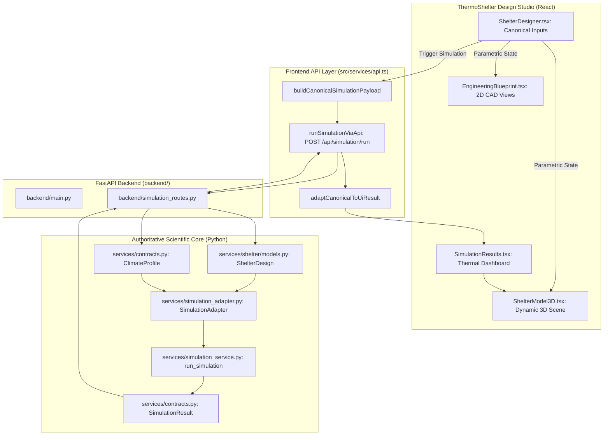

# WP2 — Engineering Design Studio + 3D + 2D Blueprint + Thermal Dashboard

**Target Branch:** `integration-react-final`  
**Status:** COMPLETE & VERIFIED  
**Work Package:** WP2 — Engineering Design Studio, 3D Interactive Visualization, 2D Parametric Blueprint, and Canonical Thermal Dashboard

---

## 1. Executive Summary

Work Package 2 (WP2) elevates the ThermoShelter React frontend into a full engineering design studio and thermal physics visualization platform:

1. **Authoritative Engineering Inputs (`ShelterDesigner.tsx`):**
   - Canonical parameters: Length, width, clear height, wall thickness, shape, orientation azimuth, roof pitch angle.
   - Fenestration & envelope: Window area, door area, multi-layer glazing specification (single, double clear, triple low-E).
   - Thermal mass & insulation: 50mm insulation envelope layer (EPS, XPS, PUF, mineral wool) and sensible thermal mass storage core.
   - Infiltration & occupancy engineering contracts (0.5 ACH, 2 occupants, continuous metabolic and ventilation tracking).
   - Reactive simulation loading indicator.

2. **Parametric 2D CAD Blueprint Engine (`EngineeringBlueprint.tsx`):**
   - **Plan A-A (Top-Down):** Structural walls, insulation boundary, orientation compass with azimuth vector, window apertures, door opening, dimensioning callouts.
   - **Section B-B (Transverse):** Foundation ground slab, clear height, wall section, pitched/flat roof structure, roof pitch angle annotation.
   - **Front Elevation:** Principal solar-facing facade, window and door placements, length and height dimensions.
   - **Detail D-01 (Multi-Layer Envelope Assembly):** ISO 6946 layer sequence ($R_{se}$, wall substrate, insulation, thermal mass, $R_{si}$).

3. **Parametric 3D Visualization (`ShelterModel3D.tsx`):**
   - Dynamic window aperture scaling computed from `windowArea`.
   - Visual insulation boundary wireframe around the envelope when insulation is selected.
   - Sensible thermal mass internal floor core slab.
   - Orientation compass, dimension lines, animated solar path, and thermal comfort glow.

4. **Canonical Simulation Results Dashboard (`SimulationResults.tsx`):**
   - Full 168-hour (7-day) forward Euler indoor vs ambient temperature timeseries with 18°C comfort threshold reference line.
   - Solar energy analysis distinguishing total incident solar irradiance on glazing vs transmitted useful solar thermal gain.
   - 6-component heat loss breakdown (Walls, Roof, Floor, Windows, Infiltration/Ventilation, and Longwave Radiation).
   - ISO 6946 multi-layer thermal transmittance U-values card ($U_{wall}$, $U_{roof}$, $U_{floor}$, $U_{window}$).
   - Discomfort degree hours (DDH), comfort status, and auxiliary heating/cooling demands.

---

## 2. Architecture & Data Flow

---

## 3. Verification & Test Summary

| Test Suite | Scope | Result | Status |
|---|---|---|---|
| Python Full Test Suite | 290 tests (`services/tests/`, `tests/`) | **290 passed** in 5.83s | **PASS** |
| React TypeScript Check (`tsc`) | `thermoshelter-design-studio/` | **0 errors** | **PASS** |
| Production Bundle (`vite build`) | HTML/CSS/JS chunks generated in `dist/` | **0 errors** | **PASS** |

---

## 4. Work Package Checkpoint

- Phase 1 Commit: `253a65f` (Pushed)
- Phase 2 Commit: `2c7f308` (Pushed)
- WP1 Commit: `877ff66` (Pushed)
- WP2 Commit: Staged on `integration-react-final`
